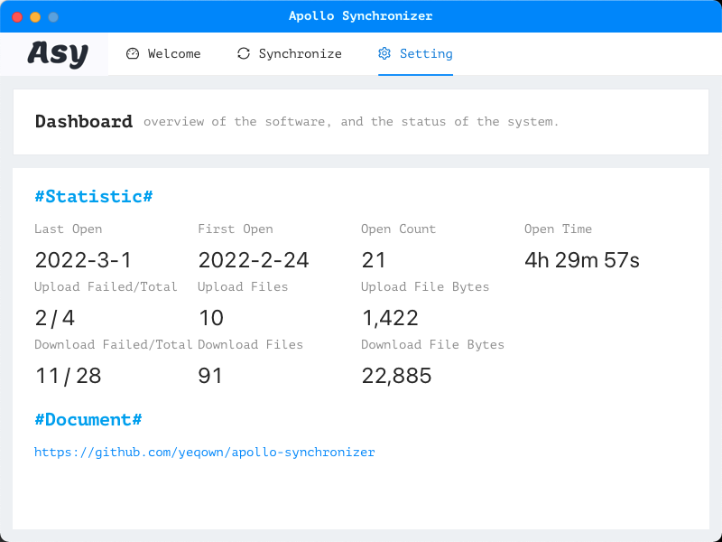
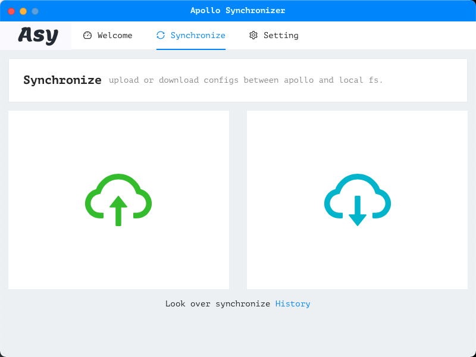
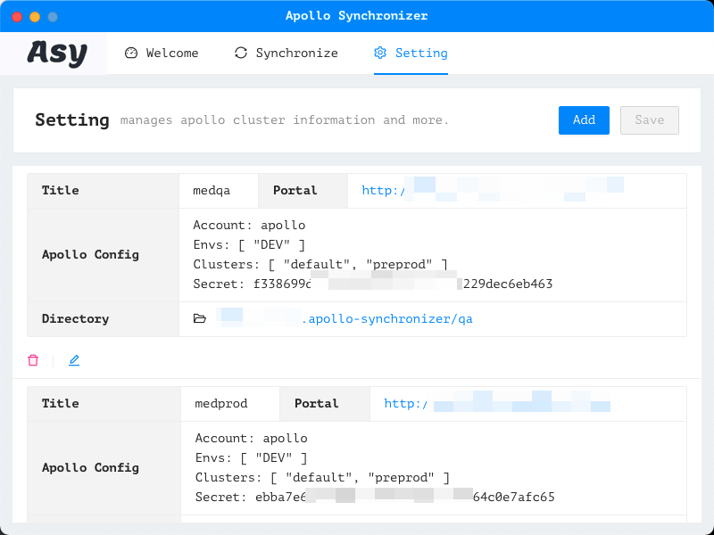
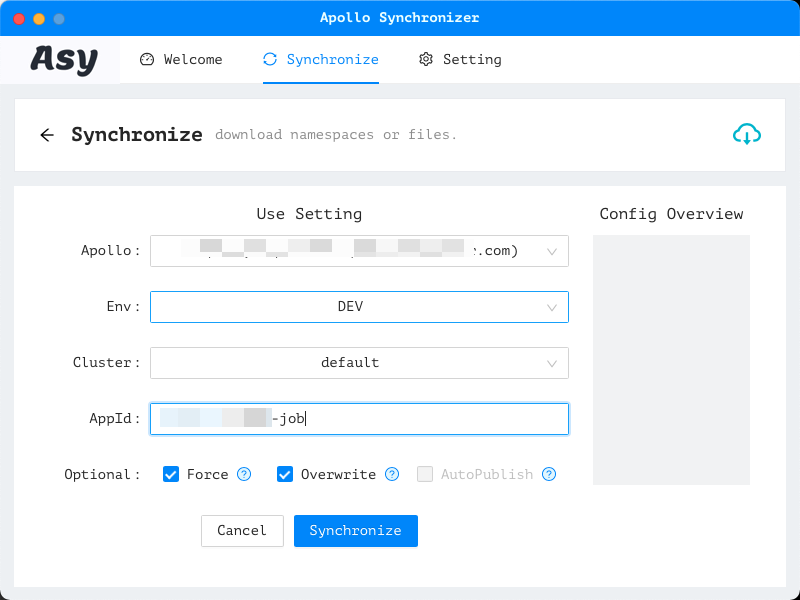
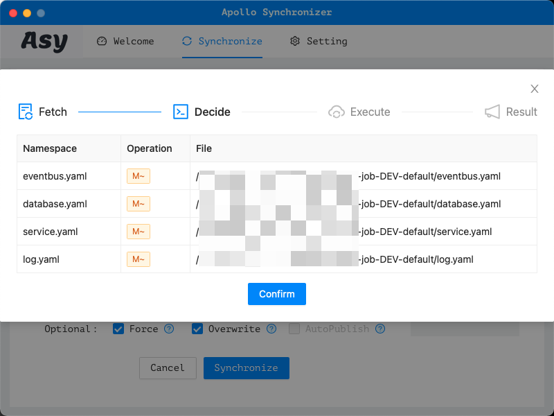
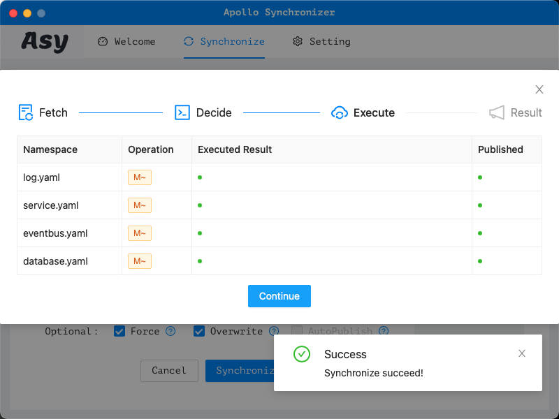

# README

## Usage shots

## About

This template uses vanilla JS / HTML and CSS.

## Live Development

To run in live development mode, run `wails dev` in the project directory. The frontend dev server will run
on http://localhost:34115. Open this in your browser to connect to your application.

## Building

For a production build, use `wails build`.

